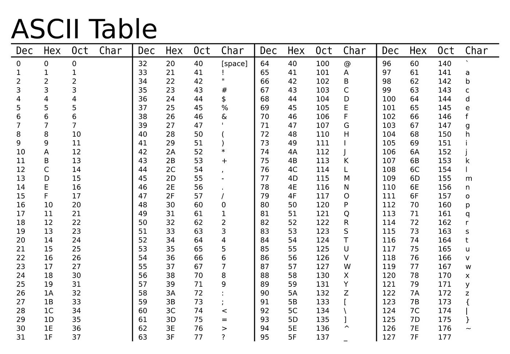
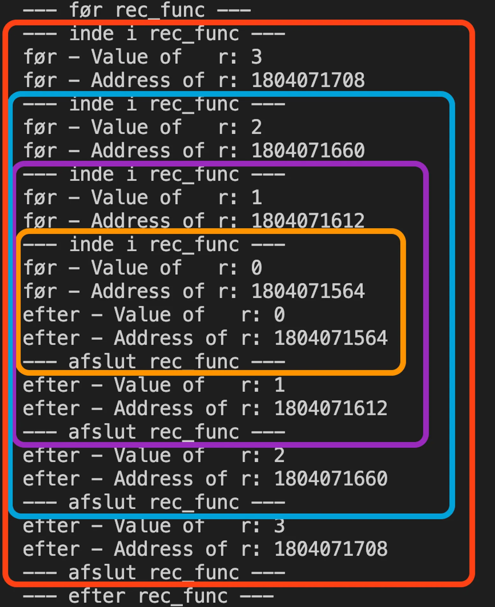
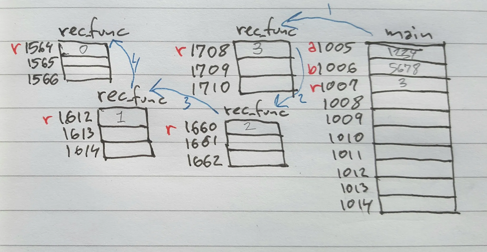
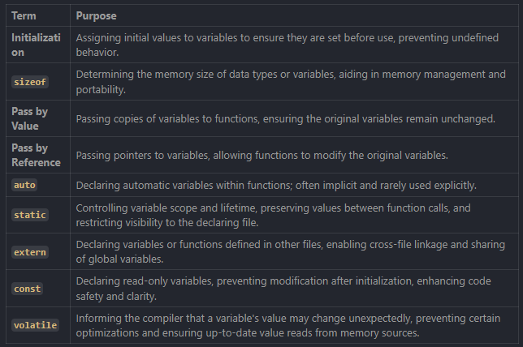
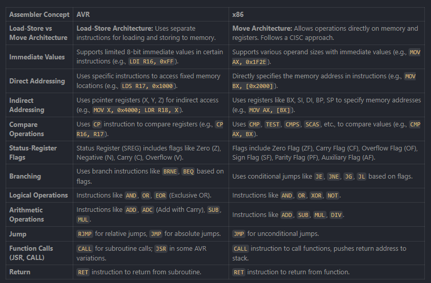
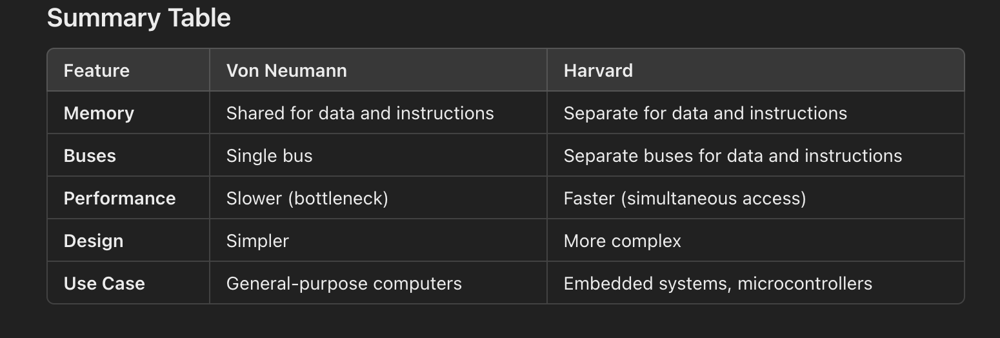
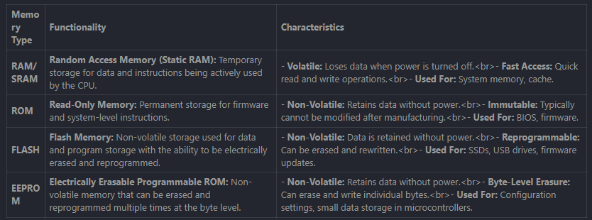
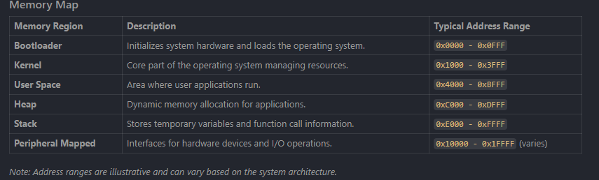
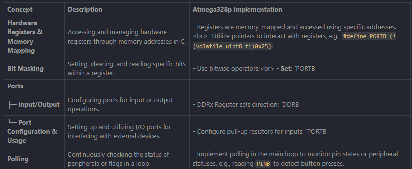
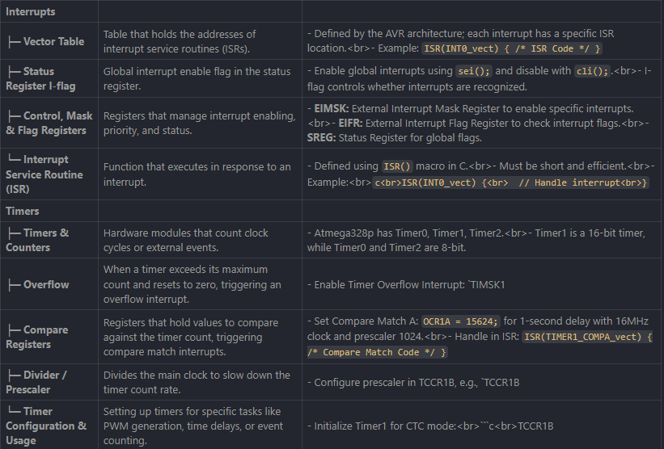

# Table of contents - Forhåbentligt et cheatsheet til C

1. [Binær forståelse](#binær-forståelse)
    - [Byte vs bits](#byte-vs-bits)
    - [Binary to decimal](#binary-to-decimal)
    - [Binary to hexadecimal](#binary-to-hexadecimal) 
2. [Operators in C](#operators-in-c)
    - [`&` AND](#-and)
    - [`|` OR](#-or)
    - [`^` XOR](#-xor)
    - [`~` NOT](#-not)
    - [`<<` LEFT SHIFT](#-left-shift)
    - [`>>` RIGHT SHIFT](#-right-shift)
    - [Signed / Unsigned bits](#signed--unsigned-bits)
    - [ASCII table](#ascii-table)
3. [Data types in C, and their typical memory(size)](#data-types-in-c-and-their-typical-memorysize)
4. [Memory](#memory)
    - [Memory allocation](#memory-allocation)
    - [Recursion](#recursion)
    - [Memory in strings](#memory-in-strings)
    - [Initialization](#initialization)
    - [sizeof](#sizeof)
    - [Pass by value vs. pass by reference](#pass-by-value-vs-pass-by-reference)
    - [Auto keyword](#auto-keyword)
    - [Static keyword](#static-keyword)
    - [Extern keyword](#extern-keyword)
    - [Const keyword](#const-keyword)
    - [Volatile keyword](#volatile-keyword)
    - [Making global variables](#making-global-variables)
    - [Sumamry of terms](#sumamry-of-terms)
    - [Pointers](#pointers)
5. [The C compiler](#the-c-compiler)
    - [Preprocessing](#preprocessing)
    - [Compilation](#compilation)
    - [Assembly](#assembly)
    - [Linking](#linking)
6. [CPU Architecture](#cpu-architecture)
    - [Von Neumann Architecture](#von-neumann-architecture)
    - [Harvard Architecture](#harvard-architecture)
    - [Address Bus](#address-bus)
    - [Data Bus](#data-bus)
    - [Control Bus](#control-bus)
7. [Microcontrollers and hardwareprogramming](#microcontrollers-and-hardwareprogramming)
8. [Hex Dump](#hex-dump)
9. [Eksamensøvelser](#eksamensøvelser)
    - [Bit shifting og ASCII](#bit-shifting-og-ascii)
    - [Array Indexering](#array-indexering)
        - [Code snippet:](#code-snippet)
        - [Opgavebeskrivelse](#opgavebeskrivelse)
        - [Key notes:](#key-notes)
        - [Assembly calculation](#assembly-calculation)
    - [String arrays and pointers](#string-arrays-and-pointers)
        - [String1:](#string1)
        - [String2:](#string2)
        - [Printout functions](#printout-functions)
            - [Pointer-based iteration](#pointer-based-iteration)
            - [Index-based iteration](#index-based-iteration)
            - [Pointer-based iteration techinal assembly](#pointer-based-iteration-techinal-assembly)
            - [Index-based iteration techinal assembly](#index-based-iteration-techinal-assembly)
            - [Memory Access Patterns](#memory-access-patterns)
            - [Assembly differences](#assembly-differences)
                - [Pointer-Based](#pointer-based)
                - [Index-Based](#index-based)
        - [Loops](#loops)
            - [Loop 1:](#loop-1)
            - [Loop 2:](#loop-2)
            - [Loop 3:](#loop-3)


# Binær forståelse
Binary is a base-2 number system. It is the number system we use to represent data in computers.
It can consist of 0's and 1's.

## Byte vs bits
- 1 byte = 8 bits
- 1 bit is represented by a single digit in binary.
    - Binary is calculated by using the powers of 2. - That means that each space in the binary number system is a power of 2, which is 2^0, 2^1, 2^2, 2^3, 2^4, 2^5, 2^6, 2^7. *written the other way around, so starting from the right and going to the left*
* Each whole row of 4 numbers in binary is a byte, which represents 8 bits and can be converted to a single digit in decimal.

## Binary to decimal
 - For at konvertere resultatet til decimal, skal man multiplicere det tal (0 eller 1) med [fra højre] **2^0**, **2^1**, **2^2**, **2^3**, **2^4**, **2^5**, **2^6**, **2^7**.
    Eksempelvis: ```10101001```:

    - ```1010100__1__``` 1 * 2^0 = 1
    - ```101010__0__1``` 0 * 2^1 = 0
    - ```10101__0__01``` 0 * 2^2 = 0
    - ```1010__1__001``` 1 * 2^3 = 8
    - ```101__0__1001``` 0 * 2^4 = 0
    - ```10__1__01001``` 1 * 2^5 = 32
    - ```1__0__101001``` 0 * 2^6 = 0
    - ```__1__0101001``` 1 * 2^7 = 128
    - I decimal giver det: 128 + 32 + 8 + 1 = 169
    - I hexadecimal: 0x9A(2109)
- Binary to decimal
    - Binary to decimal
        - 10010110 = 101 (decimal)
        - 10101001 = 102 (decimal)
        - 11011010 = 110 (decimal)
        - 11101010 = 111 (decimal)

## Binary to hexadecimal

- Binary to hexadecimal
    - Binary to hexadecimal
        - 01010110 = 0xA6 (hexadecimal)
        - 10101001 = 0xA2 (hexadecimal)
        - 11011010 = 0xAC (hexadecimal)
        - 11101010 = 0xAE (hexadecimal)

# Operators in C
- Bitwise operators
    - Bitwise operators
        - `&` AND 
        - `|` OR
        - `^` XOR
        - `~` NOT
        - `<<` LEFT SHIFT
        - `>>` RIGHT SHIFT
## Explanation
## `&` AND
 - Think of it like a strict rule; if both things are true, then the result is true (1). If neither thing is true, then the result is false (0).
 - What it does: Compares two bits and gives 1 only if **both** bits are 1.
 - Example: ```01010110 & 01101001 = 01010110 & 01101001 = 10101001```
 - Ovenover: Kig på *01101001* og *01010110* - lad os dele den op fra højre til venstre og sammenlign om der står 1 på de samme pladser. Hvis der er 1 på de samme pladser, så returneres 1 i resultatet.
 - Hvis der ikke er 1 på de samme pladser, så returneres 0 i resultatet.
   

## `|` OR
- What it does: Compares two bits and gives 1 if **either** bit is 1.
- Think of it like a flexible rule; if at least one thing is true, then the result is true (1).
- Example ```01010110 | 01101001 = 01111111
- Ovenover: Kig på *01101001* og *01010110* - lad os dele den op fra højre til venstre og sammenlign om der står 1 på de samme pladser.
- ```0110100__1__ | 0101011__0__``` = 1
- ```011010__0__1 | 010101__1__0``` = 1
- ```01101__0__01 | 01010__1__10``` = 1
- ```0110__1__001 | 0101__0__110``` = 1
- ```011__0__1001 | 010__1__0110``` = 1
- ```01__1__01001 | 01__0__10110``` = 1
- ```1__0__101001 | 0__1__010110``` = 1
- ```__0__10101001 | __0__1010110``` = 0
        - Set i bakspejlet er det her et virkelig dårligt binært tal at bruge som eksempel, dog kun fordi det viser et meget stort tal som virker dårligt i de forskellige usecases nedenfor. Hav det i mende når du læser det her.

## `^` XOR	
 - Its a little trickier; it gives true (1) if the two bits are different, and false (0) if they are the same.
 - If you compare 2 light switches, and one is on and other is off, the result is true (1).
 - If the two light switches are on, the result is false (0).
 - If the two light switches are off, the result is false (0).
 - If the two light switches are on and off, the result is true (1).

## `~` NOT
 - What it does: Reverses all the bits. If it is a 1, it becomes a 0. If it is a 0, it becomes a 1.
 - Example: ```01010110 = ~101```

## `<<` LEFT SHIFT
 - What it does: Shifts all the bits to the left by 1.
 - Example: ```01010110 << 1 = 10101100```

## `>>` RIGHT SHIFT
- What it does: Shifts all the bits to the right by 1.
- Example: ```10101100 >> 1 = 01010110```
    
## Signed / Unsigned bits
- Signed bits
     - Signed bits are the ones that are used to store negative numbers.
    - They are stored in two's complement format. Meaning they have a sign bit and a value bit.
    - The sign bit is used to determine if the number is positive or negative. This is done by checking if the most significant bit is a 1. If it is, the number is negative, otherwise it is positive.
    - The value bit is used to store the actual value of the number.
     - Example: The number -128 is stored as 10000000 00000000. The sign bit is 1, and the value bit is 00000000 00000000.
        Therefore, the number is negative and every place it says 0 is a 1.
- Unsigned bits
    - Unsigned bits are the ones that are used to store positive numbers.
    - They are stored in one's complement format. Meaning they have a value bit. The value bit is used to store the actual value
    - Example: The number 128 is stored as 00000000 10000000. The value bit is 00000000 00000000.

## ASCII table


# Data types in C, and their typical memory(size)
- char: 1 byte
- short: 2 bytes
- int: 4 bytes
- long: 8 bytes
- long long: 8 bytes
- float: 4 bytes
- double: 8 bytes
- unsigned char: 1 byte
- unsigned short: 2 bytes
- unsigned int: 4 bytes
- unsigned long: 8 bytes
- unsigned long long: 8 bytes
- unsigned float: 4 bytes
- unsigned double: 8 bytes


# Memory
In C, memory management refers to the allocation, use and deallocation of memory during the execution of a program.
### Memory allocation
Memory is divided into 2 main areas: 
- Stack - This is the order in which functions and the variables are called in the program. The stack is simply explained as a stack of books, you can only access the top of the stack, and you can only add books to the top of the stack.
- Heap - This is best explained as a "grid" where you can point to a specific "square" in the grid to which you chose to allocate certain calls, these calls are then located at a specific address in the heap. The heap is the area where the actual data is stored.

*Less technical visualization*
```
+-----------------------------+
|         High Memory         |
+-----------------------------+
|        Read-Only Data       |
|        (e.g., string        |
|        literals)            |
+-----------------------------+
|        Initialized Data     |
|        (Global Variables)   |
+-----------------------------+
|        Uninitialized Data   |
|        (BSS Segment)        |
+-----------------------------+
|            Heap             |
|  (Dynamic Memory Allocation)|
|  Grows upwards              |
+-----------------------------+
|            Stack            |
|  (Function Calls, Local     |
|   Variables)                |
|  Grows downwards            |
+-----------------------------+
|          Low Memory         |
+-----------------------------+
```

*More technical visualization*
```
+-----------------------------+
|         High Memory         |
+-----------------------------+
|        Read-Only Data       |
|        (e.g., string        |
|        literals)            |
+-----------------------------+
|        Initialized Data     |
|        (Global Variables)   |
+-----------------------------+
|        Uninitialized Data   |
|        (BSS Segment)        |
+-----------------------------+
|            Heap             |
|  (Dynamic Memory Allocation)|
|  Grows upwards              |
|  [malloc] --> [Memory A]    |
|              [Memory B]     |
|              ...            |
+-----------------------------+
|            Stack            |
|  (Function Calls, Local     |
|   Variables)                |
|  Grows downwards            |
|  +-----------------------+  |
|  |  Local Variables      |  |
|  |  e.g., int stackVar   |  |
|  |  int *heapVar         |  |
|  +-----------------------+  |
|  |  Return Address       |  |
|  +-----------------------+  |
|  |  Previous Stack Frame |  | 
|  +-----------------------+  |
|        ... (Other stack     |
|        frames)              |
+-----------------------------+
|          Low Memory         |
+-----------------------------+
```

### Recursion
Recursion occurs when a function calls itself to solve a smaller instance of a problem until a base condition is met. Each recursive call creates a *new stack frame* with its own set of variables. Therefore the addresses of the same integers for instance, can actually have the same value but different addresses since they are called recursively and in their own stack. 



- watch the squares and pay attention to the values and their addresses, they are the seperate stacks that memory-management is based on.



### Memory in strings
When a string is declared, it is stored in the heap. It is possible to change the value of a string in the stack, but it leaves the value of the declared variable on the same address in the heap.
- Example: ```char word[4] = {99, 97, 116, 0};``` 
    - This creates a string with 4 characters, and stores the value of each character in the array.
    - If you change the value of 99 to 100, the value of the string is changed but the address is unchanged if the call structure is the same.
    - Initializing 2 arrays will retun the addresses of the last most initialized array as "higher" in the stack.
    - Earlier we have been able to redeclare addresses within other variables each other: ```b = a; ```, this is not possible with arrays in C, they are unique in the heap.
    - If we want to change/copy the value of an array, we have to do it manually or with a loop. The loop looks like this:
        - ```for (int i = 0; i < 4; i++)```
    - We do need to hardcode the size of the array, because the size is not stored in the variable.

### Memory leaks
- Memory leaks are when a program allocates memory but does not free it.
- This can happen when a program is not finished, or when a program is running for a long time.
- Memory leaks can cause a program to use more and more memory, eventually causing the program to crash.
- Memory leaks can also cause a program to use more and more memory, eventually causing the program to crash.
- A key point to prevent this is always to pair ```malloc()``` with ```free()```.

### Memory analogy
Simple Analogy

- Imagine a house (your program):

    - Code segment: The blueprint of the house (instructions that don't change).
    - Data segment: The furniture that comes with the house (static/global variables).
    - Stack: The table you set up when cooking (temporary items for function calls).
    - Heap: The attic where you store extra stuff when needed (dynamic memory).

### Initialization
- Initialization is the process of assigning an initial value to a variable.
#### Why it is important: 
- Predictability: Initialized variables behave predicably from the start, which can help with debugging and testing.
- Avoiding undefined behavior: Using uninitialized variables can lead to undefined behavior, which can cause the program to crash or produce incorrect results.
Example: 
```int a = 10;``` // a is initialized with the value 10
```char letter = 'A';``` // letter is initialized with the character 'A'	
Explanation:
- In the first line the integer variable 'a' is initialized with the value 10. This means that the variable will always have the value 10 from the start of the program.
- In the second line the character variable 'letter' is initialized with the character 'A'. This means that the variable will always have the value 'A' from the start of the program.

### sizeof
- The sizeof operator is used to determine the size of a variable in bytes.
- it returns the size of the variable in bytes.
#### Why it is important:
- Portability: Helps write code that is portable across different systems by not hardcoding memory sizes. 
- Memory management: Assists in dynamic memory allocation to ensure enough memory is allocated for data types. 
Example:

```
#include <stdio.h>

int main() {
    int num = 5;
    printf("Size of int: %zu bytes\n", sizeof(int));
    printf("Size of num: %zu bytes\n", sizeof(num));
    return 0;
}
```
Output:
```
Size of int: 4 bytes
Size of num: 4 bytes
```
Explanation: 
- ```sizeof(int)``` returns the size of an integer in bytes, which is 4 on most systems.	
- ```sizeof(num)``` returns the size of the variable 'num' in bytes, which is also 4 on most systems.

This can also be used to determine the size of arrays:
```
int arr[10];
size_t size = sizeof(arr) / sizeof(arr[0]); // Calculates the number of elements
```

### Pass by value vs. pass by reference
Overall this is crucial to understanding how data is manipulated in C.

#### Pass by value
- Passing by value means that a copy of the value is passed to the function.
- Changes made to the parameter inside the function will not affect the original variable.
Example:
```
#include <stdio.h>

void increment(int x) {
    x = x + 1;
    printf("Inside function: x = %d\n", x);
}

int main() {
    int a = 5;
    increment(a);
    printf("Outside function: a = %d\n", a);
    return 0;
}
```
Output:
```
Inside function: x = 6
Outside function: a = 5
```
Explanation:
- The function 'increment' recieves a copy of 'a (x)', increments it, but 'a' remains unchanged outside the function. 

#### Pass by reference
- Pass by reference involves passing the address of the variable to the function using pointers. 
- Changes made to the parameter inside the function will affect the original variable.
Example: 
```
#include <stdio.h>

void increment(int *x) {
    *x = *x + 1;
    printf("Inside function: x = %d\n", *x);
}

int main() {
    int a = 5;
    increment(&a);
    printf("Outside function: a = %d\n", a);
    return 0;
}
```
Output: 
```
Inside function: x = 6
Outside function: a = 6
```
Explanation:
- The function 'increment' receives the address of 'a (x)' using a pointer, increments it, and 'a' is updated outside the function.

## When to use pass by value vs. pass by reference
- Pass by Value:
    - When you want to ensure that the original variable remains unchanged.
- Pass by Reference:
    - When you need the function to modify the original variable or when passing large data structures for efficiency.


### Auto keyword

- The 'auto' keyword is used to declare automatic variables. 
- Usage is largely implicit and often omitted, because variables declared within the functions are automatically 'auto' by default.
- It is a good practice to use 'auto' for variables that are only used within the function, as it helps avoid potential errors and makes the code more readable.

- Definition:
    - Automatic Variables (auto): Variables that are declared inside a function and are automatically allocated and deallocated on the stack when the function is called and returns, respectively

Example: 
```
#include <stdio.h>

int main() {
    auto int a = 10; // 'auto' keyword is optional here
    int b = 20;      // Equivalent to 'auto int b = 20;'
    printf("a = %d, b = %d\n", a, b);
    return 0;
}
```

Explanation: 
- both 'a' and 'b' are automatic (auto) variables. The auto keyword is redundant in this case, but it is good practice to include it to make the code more readable.

### Static keyword
- The 'static' keyword in C serves two primary purposes:
    - Controlling the scope of variables AND preserving their values between function calls.

Example: 
```
#include <stdio.h>

void counter() {
    static int count = 0; // Initialized only once
    count++;
    printf("Count = %d\n", count);
}

int main() {
    counter(); // Count = 1
    counter(); // Count = 2
    counter(); // Count = 3
    return 0;
}
```
Explanation: 
- The variable 'count' is declared as 'static', which means it is only initialized once and retains its value between function calls.
- the static keyword is limited to the scope of the function and file, it cannot be used outside of the function or file.

To make it shared you can add the ```shared```keyword to the variable declaration as such: ```static shared int count = 0;```

### Extern keyword
- The 'extern' keyword is used to declare external variables.
- It is used to declare variables that are defined in another file.

Example: 
```
// file1.c
#include <stdio.h>

int shared = 42; // Definition of 'shared'

void printShared() {
    printf("Shared = %d\n", shared);
}
```
```
// file2.c
#include <stdio.h>

extern int shared; // Declaration of 'shared'

int main() {
    printf("Accessing shared from file2: %d\n", shared);
    return 0;
}
```
From there compile both files
```
gcc file1.c file2.c -o program
```
Output: 
```
Accessing shared from file2: 42
```
Explanation: 
- The variable 'shared' is declared as 'extern' in file1.c, which means it is defined in another file.

### Const keyword
- The 'const' keyword is used to declare read-only variables.
    Once a const variable is declared/initialized, it cannot be changed throughout the program.
    - Example: ```const int MAX = 100;``` // MAX is a constant variable that can only be assigned a value of 100.
    Any attempt to change the value of MAX will result in a compilation error. MAX is immutable.
- Can be used to protect data that should not be modified.
- It is good practice to use const whenever possible to prevent accidental modification of data.

### Volatile keyword
- The volatile keyword is used to declare variables that can change value at any time.
- It is used to prevent the compiler from optimizing the code.
- Example: ```volatile int counter = 0;``` // counter is a volatile variable that can change value at any time.
- Great to use in Hardware registers, interrupts and other hardware-related code.
    It is a keyword assigned to a variable, preferably at the beginning of a function or a file, so that the compiler knows that the variable can change value at any time.


### Making global variables
Global variables are variables that can be accessed from anywhere in the program.
- Global variables are declared outside of any function. (also main)
- Can be accessed from anywhere if used with the extern keyword.
- SHARED VARIABLES CAN BE GLOBAL VARIABLES BUT NOT ALL GLOBAL VARIABLES ARE SHARED VARIABLES. 
- Shared variables exist specifically in programs involving multiple processes, multithreading, and inter-process communication.

### Sumamry of terms


### Pointers
Pointers are variables that store the address of another variable.
- Pointers are used to point to a specific memory location.
- Pointers are used to pass variables to functions.

```int a = 10;``` // a is a variable that stores the value 10

```int *p = &a;``` // p is a pointer that stores the address of a

```&a``` This is the *address of* operator, when used in a function such as ```printf()``` it will print the address of the variable.
- Pointers are quite useful, but also quite complicated: 
    - Pointers can point at pointers, which can point at pointers, and so on.
    - Pointers are not always the best solution to a problem, but they are the most common.
    - For instance you can have a variable that has a value, which is then placed at a specific address in the heap, then you can chose to point to that variable and place it in a different location in the heap.
    - This is called **dynamic memory allocation**.
    - The pointer can be used to point to a specific memory location, and the memory location can then be changed.
    

# The C compiler
Overall the compling consists of 
- Preprocessing (the -E flag) eg. `gcc -E array.c -o array.i` - Processes directives.
- Compilation (the -S flag) eg. `gcc -S array.i -o array.s` - Compiles to assembly.
- Assembly (the -c flag) eg. `gcc -c array.s -o array.o` - Compiles to object code.
- Linking (the -o flag) eg. `gcc array.o -o array.exe` - Links object code to executable.

```
+-------------------+
|  Source Code (C)  |
+-------------------+
          |
          v
+-------------------+
|    Preprocessing  |
|  (Handles #include|
|   and Macros)     |
+-------------------+
          |
          v
+-------------------+
|    Compilation    |
| (C Code to Assembly)|
+-------------------+
          |
          v
+-------------------+
|     Assembly      |
|(Assembly to Object)|
+-------------------+
          |
          v
+-------------------+
|      Linking      |
| (Combine Object   |
|   Files into Exec)|
+-------------------+
          |
          v
+-------------------+
|   Executable File |
+-------------------+
```

## Preprocessing
The preprocessor is a program that is run before the compiler, this process scans the code and includes any files that are needed, expands macros etc. The preprocessor is also used to remove comments and to replace constants with their values. ***Errors occuring in this part of the process could be due to the #include files are not found *** _However warnings and errors related to C code is not checked at this stage._**

## Compilation
The compiler takes the code and turns it into assembly code. The assembly code is then turned into machine code. It is in this step that the compiler will check for errors and warnings. ***Errors checked here are related to syntax errors in the C code.***

## Assembly
The assembly code is then turned into machine code. This is done by the assembler. Assembly code is the lowest level of code that the computer can understand.
- At this stage of the compilation process, .o files are created for the machine to read/understand.
**Errors at this stage are rare, and no C code language errors are checked here**

## Linking
At this stage the .o files are linked together to create the final executable. 
- Windows make them as ```.exe``` files
- Linux make them as ```.out``` files
- Mac just make them as files with no extension.
The files consist of binary code that the computer can understand.

## From the podcast
Think of the compiler as a translator. It takes human words and transates them into machine code. 
The compiler also acts as quality control.
Loop unrolling: The compiler will unroll loops for you.
- Preprocessing: #include files using this is like including a library, so you can fetch certain functions from that library.
- Compilation: The compiler translates this code into assembly code, which is a low level representation of the code which the computer can understand.
- Assembly: The assembly code is translated into machine code, which is the lowest level of code that the computer can understand.
- Linking: All of the above steps are linked together to create a .exe file or .out file.
- Libraries: The compiler will also fetch certain libraries from the internet, so you can use certain functions from those libraries.
    - Different types of libraries: 
        - Static libraries: These are libraries that are stored on your computer, so you can use them in your program.
                - Downside: Baked directly into the program, so you can't update the library without recompiling the program. Also the .exe file is larger.
                - Upside: Programs become self-contained, so you don't need to worry about the libraries being updated.
        - Dynamic libraries: Also known as shares libraries. These libraries are loaded into the computer's memory when the program is run, so you don't need to worry about the libraries being updated.
                - Downside: You need to download the library before you can use it.
                - Upside: Since the library is loaded directly, you dont have to recompile you can just update the library and the program will work.

## Role of the Header files

# CPU Architecture
This chapter will cover the architecture of the CPU.
## Registers

## Assembler
- X86 is the most common architecture for computers. - It allows operations directly on memory and registers.
- AVR is a microcontroller architecture that is very similar to x86.
- X86
    - Load-Store Architecture
        - Allows operations directly on memory and registers.
        - Follows a CISC architecture (Complex Instruction Set Computer) approach, where all instructions are executed in a single clock cycle. This allows for complex instructions that can directly manipulate memory.
    - Move Architecture
        - Supports moving data between memory and registers without additional load/store instructions.
    - Immediate Values
        - X86 supports various operand sized with immediate values. These are fixed numbers used directly in instructions.
    - Direct Addressing
        - X86 supports direct addressing, where the address of a memory location is specified directly in the instruction.
    - Indirect Addressing
        - X86 supports indirect addressing, where the address of a memory location is specified indirectly in the instruction.
        - X86 Uses registers like BX, SI, DI, BP, SP to specify the address of a memory location.
    - Compare operations
        - Compare operations check how two values relate (equal, greater than, less than, etc.).
        - X86 supports various compare operations, such as CMP, TEST, CMPS, SCAS, etc.
    - Status-Register flags
        - Indicators that show the result of a compare operation.
        - X86 supports various status-register flags, such as ZF, CF, OF, SF, PF, AF, etc.
    - Branching
        - Changes the program path based on flag statuses.
    - Moving data 
        - MOV instruction moves data between registers and memory.
        - MOVZX instruction moves data between registers and memory, and zero-extends the data.
fuck it check the picture. do a quick google or AI prompt if you need to. make sure you understand the differences between the different architectures.
- AVR
    - Load-Store Architecture
        - Uses seperate instructions for loading and storing to memory.
        - Follows a RISC-like approach, where only load and store instructions access memory. All arithmetic operations are done in registers.
    - Move Architecture
        - Relies on explicit load and store instructions for memory operations.



## Bus width / register width
- The width of the bus is the number of bits that can be transferred at once.
- The width of the register is the number of bits that can be stored in a single register.
- The width of the bus and the width of the register are related to each other.
    - The width of the bus must be greater than or equal to the width of the register.
    - The width of the register must be a power of 2.
    - For example, a 16-bit bus can transfer 16 bits at a time, while a 32-bit bus can transfer 32 bits at a time.
    - A 16-bit register can store 16 bits, while a 32-bit register can store 32 bits.

## Von Neumann Architecture
- The CPU is made up of a central processing unit (CPU) and a memory.
- This type of architecture is like a single road, for both data and instructions.
- The CPU is the brain of the computer, and the memory is where the data is stored.
- One memory Space: Data (like variables) and instructions (like the program) are stored in the same memory space.
- Shared bus: The CPU uses one set of wires (a "bus") to read and write data and instructions.
- Sequential access: Because there is only one bus, the CPU can only fetch either data or an instruction at a time.
    - Pros: 
        - Simpler design
        - Flexible: Memory can be used for either data or instructions as needed.
    - Cons:
        - Slower: Because the CPU has to wait for the bus to be free, it can't fetch two instructions at the same time. This is called the "Von Neumann bottleneck".
    - Example: 
        - CPU fetches instruction
        - CPU fetches data
        - CPU writes data
        - CPU writes instruction
        - CPU repeats
- Cache: The CPU can store data and instructions in a cache, which is a small memory that is faster than the main memory.

## Harvard Architecture
This is like having two seperate roads, one for data and one for instructions.
- Seperate memory spaces: Data and instructions are stored in different memory spaces. 
- Seperate buses: The CPU uses two sets of wires (buses) to read and write data and instructions simultaneously.
- Parallel access: The CPU can fetch both data and instructions at the same time.
    - Pros:
        - Faster: Because the CPU can fetch two instructions at the same time, it can complete two instructions in the same time.
        - More efficient: Prevents accidental overwriting of program instructions.
    - Cons:
        - More complex to design, more wires to connect.
        - Less flexible: Memory can only be used for data or instructions, not both.
Summary:


## Address Bus
The address bus is the bus that connects the CPU to the memory.
- They transfer information in the form of electrical signals. In most systems there are 3 main types of buses:
    - Address bus: This is like a map, that tells the CPU where to find the data or instructions.
        - Purpose: Carries the memory address of the data or instruction the CPU wants to access.
        - It typically runs in 1 direction, from the CPU to memory or I/O devices.
        - Size: Depends on the system: A 16-bit address bus can address 2^16 (64KB) bytes of memory, while a 32-bit address bus can address 2^32 (4GB) bytes of memory.
    - Analogy: The address bus is like a delivery driver who recieves the address (location in memory) of a house but doesn't carry the package himself, the bus does that.

## Data Bus
This bus is like the delivery truck that carries the actual information (data) to the CPU.
- Purpose:
    - Transfers the data between the CPU, memory and peripheral devices.
    - It typically runs in both directions, from memory to the CPU and from the CPU to peripheral devices.
    - Size: Determines how much data can be transferred at once. An 8-bit data bus transfers 1 byte at a time, while a 16-bit data bus transfers 2 bytes at a time.
    - Analogy: This is the actual truck that delivers the package to the house.
## Control Bus
This bus is like the traffic lights that control the delivery truck and coordinate the flow of data.
- Purpose:
    - Carries control signals from the CPU to coordinate activities (e.g. read/write operations, interrupts, etc.).
    - It is typically bi-directional, depending on the signal sent.
    - Signals: 
        - Read (RD): Indicates that the CPU wants to read data from memory.
        - WRITE (WR): Indicates that the CPU wants to write data to memory.
        - Interrupt (INT): Indicates that the CPU wants to interrupt the current activity and handle an external event.
        - Clock (CLK): Synchronizes the operations of the CPU and memory.
    - Analogy: The control bus is like the traffic lights that control the delivery truck (data and address buses) when to stop, go or change direction.

## Memory

### Memory map


# Microcontrollers and hardwareprogramming
- Concept of microcontrollers


- Interrupts

# Hex Dump

Hex dump er en tekst-fil, der viser en binær fil i en hexadecimal format. Dette er et af de mest almindelige formater for at vise binære data. 

# Hexdumpers der kan bruges

- Hexyl
- Hexdumper

# Kommandoer til de forskellige.

## Hexyl
- Dump a file: Kommando: ```hexyl ${filename}```
- Dump a file and show the offset: Kommando: ```hexyl -s ${offset} ${filename}```
- Dump a file and show the offset and number of bytes: Kommando: ```hexyl -s ${offset} -n ${number_of_bytes} ${filename}```
- Dump a file and show more or less: ```hexyl ${filename} | less``` / ```hexyl ${filename} | more```
- Dump a file and save it to a file: Kommando: ```hexyl -n ${number_of_bytes} ${filename} > ${filename}.hex```
- Dump a file and save it to a file and show more or less: ```hexyl -n ${number_of_bytes} ${filename} > ${filename}.hex && less ${filename}.hex```
- Dump a file and search for a specific sequence of bytes: Kommando: ```hexyl -n ${number_of_bytes} ${filename} | grep ${sequence_of_bytes}```

## Hexdumper
- Dump a file: Kommando: ```hexdump -C ${filename}```
- Dump a file and show the offset: Kommando: ```hexdump -C -s ${offset} ${filename}```
- Dump a file and show the offset and number of bytes: Kommando: ```hexdump -C -s ${offset} -n ${number_of_bytes} ${filename}```
- Dump a file and show more or less: ```hexdump -C ${filename} | less``` / ```hexdump -C ${filename} | more```
- Dump a file and save it to a file: ```hexdump -C ${filename} > ${filename}.txt```
- Can now be opened in VS Code using CLI: ```code ${filename}.txt```

## Hvorfor man bruger disse kommandoer

### Hexyl & Hexdumper
1. For at få vist filen i hexadecimaler
2. for at vise et bestemt antal bits af filen
3. For at vise et bestemt antal bytes men samtidiigt starte med et bestemt offset.
4. For at vise en fil i hexadecimaler og vise den i et tekst format. *Til denne så brug hexdump, den giver det bedste resultat at vise det i*
5. For at søge efter en bestemt sekvens af bits i en fil *Til denne så brug hexdump, den giver det bedste resultat at vise det i*

# Eksamensøvelser

## Bit shifting og ASCII

## Array Indexering
### Code snippet:
```
#include <stdio.h>

int main()
{
  char letters[] = {'a', 'b', 'c', 'd', 'e', 'f'};

  for (int i = 0; i < 6; i++)
  {
    printf("Letter @ index %d is '%c'\n", i, i[letters]);
  }

  return 0;
}
```
#### Opgavebeskrivelse
- På trods af hvad det måske ser ud til, er der ingen fejl i dette program:
- Hvorfor ser det ud som om der er en fejl? Og hvorfor virker det alligevel?

- Forklar præcis hvordan array-indexet bliver beregnet.

- Vis hvordan beregningen foregår i assembler (maskinkode) - og vis også den udgave der ser mere korrekt ud.
#### Key notes:
- The program looks wrong because it is using the ```i[letters]``` - the more common use is ```letters[i]```
- The compiler interprets both as ```*(letters + i)```
- At assembly level, the calculation involves adding the base address of *letters* to the index *i*, multiplied by the size of each element.
- Regardless of the order: the indexing works as long as one operand is a pointer and the other is an integer.

#### Assembly calculation
1. Suppose ```letters``` is at address ```0x1000```.
2. Each ```char ``` in the array occupies 1 byte. 
3. In the 'for' loop: the index calculatiion is ```i=2``` so ```letters + i ``` results in ```0x1000 + (2*1) = 0x1002```
4. The value at ```0x1002```(which is 'c') is dereferenced and used. 
**Dereferencing**
- In C, dereferencing is like opening an envelope to read the letter (actual piece of paper, nothing to do with the array above) inside. Think of a pointer as an address (the envelope), and dereferencing is the act of going to that actual address and retrieving the actual value (the letter).

#### Assembly code
* Breaking down the assembly code:
```
push    rbp              ; Save the base pointer of the calling function.
mov     rbp, rsp         ; Establish a new base pointer for the current function.
sub     rsp, 16          ; Allocate 16 bytes of space on the stack for local variables.
```
* The first line is the push instruction, which is used to save the current value of the base pointer (rbp) on the stack.
* The second line is the mov instruction, which is used to establish a new base pointer for the current function.
* The third line is the sub instruction, which is used to allocate 16 bytes of space on the stack for local variables.

This sets up the stack frame for the function, which includes the base pointer and the local variables.

```
mov     DWORD PTR [rbp-10], 1684234849  ; Store 1684234849 at `[rbp-10]`.
mov     WORD PTR [rbp-6], 26213         ; Store 26213 at `[rbp-6]`.
mov     DWORD PTR [rbp-4], 0            ; Initialize `[rbp-4]` (a counter) to 0.
```
* word for word: mov instruction that moves a 16-bit value from one location to another.
* DWORD PTR: (double word pointer): specifies that the source and destination are memory addresses, and stores them at the abovementioned address. ```[rbp-10]``` likely represents the start of an array in memory.
* The first line moves the value 1684234849 to the memory address at `[rbp-10]`.
* The second line moves the value 26213 to the memory address at `[rbp-6]`, likely the next 2 bytes in the array.
* The third line initializes the counter at `[rbp-4]` to 0.

Next part of the code:

```
jmp     .L2               ; Jump to the loop condition check.
```
* the `jmp` instruction jumps to the loop condition check.

Next part of the assembly code: 
```
.L3:                            ; Loop body label.
    mov     eax, DWORD PTR [rbp-4]       ; Load the loop counter into `eax`.
    cdqe                                ; Convert `eax` to `rax` (zero/sign-extend).
    movzx   eax, BYTE PTR [rbp-10+rax]  ; Access the byte at `[rbp-10 + rax]`.
    movsx   edx, al                     ; Sign-extend the byte value into `edx`.
    mov     eax, DWORD PTR [rbp-4]      ; Reload the loop counter.
    mov     esi, eax                    ; Move the loop counter into `esi` (argument for `printf`).
    mov     edi, OFFSET FLAT:.LC0       ; Load the format string address into `edi`.
    mov     eax, 0                      ; Set `eax` to 0 (for `printf` call convention).
    call    printf                      ; Call `printf`.
    add     DWORD PTR [rbp-4], 1        ; Increment the loop counter.

```
- The loop counter ([rbp-4]) determines which byte of [rbp-10] is accessed.
- `movzx` loads the current byte from the "array" (memory region starting at [rbp-10]) and zero-extends it to eax.
- The byte is then extended to edx for use as an argument to printf.
- `edi` holds the address of the format string (likely "%c").
- `esi` passes the current byte to printf as the second argument.

```
.L2:                             ; Loop condition label.
    cmp     DWORD PTR [rbp-4], 5 ; Compare the loop counter to 5.
    jle     .L3                  ; If counter <= 5, jump back to loop body.
```
* The loop iterates 6 times, since the code states that the index > 6.
* In assembly it stops when it hits `[rpb-4] > 5` as it compares the loop counter to 5.

* the remainding part of the assembly code involves the clean up and sets the return value to 0, it restores the `rbp` and adjusts the `rsp`. 


### General assembly keywords:
| Keyword/Instruction | Meaning                                                                                     |
|---------------------|---------------------------------------------------------------------------------------------|
| push                | Pushes a value onto the stack. Used to save registers or parameters during function calls.  |
| pop                 | Removes (pops) the top value from the stack into a register or memory location.             |
| mov                 | Moves data between registers, memory, or immediate values.                                  |
| add                 | Adds two values and stores the result in a register or memory.                              |
| sub                 | Subtracts one value from another and stores the result.                                     |
| cmp                 | Compares two values (sets flags based on the result). Often used before jumps.              |
| jmp                 | Unconditionally jumps to a specified label or memory address.                               |
| jle                 | Jumps if the previous comparison result indicates less than or equal (≤).                   |
| je                  | Jumps if equal (==) based on the previous comparison.                                       |
| jne                 | Jumps if not equal (!=).                                                                    |
| jl                  | Jumps if less than (<).                                                                     |
| jg                  | Jumps if greater than (>).                                                                  |
| call                | Calls a function by pushing the return address onto the stack and jumping to the function.  |
| ret                 | Returns from a function, popping the return address from the stack and jumping to it.       |
| leave               | Cleans up the current function’s stack frame (restores rbp and adjusts rsp).                |
| movzx               | Moves data and zero-extends it to a larger register size. Often used for unsigned values.   |
| movsx               | Moves data and sign-extends it to a larger register size. Often used for signed values.     |
| cdqe                | Converts a 32-bit `eax` register to a 64-bit `rax` by sign-extending the value.             |
| xor                 | Performs bitwise XOR. Commonly used to zero out a register (e.g., `xor eax, eax`).          |
| and                 | Performs bitwise AND between two values.                                                    |
| or                  | Performs bitwise OR between two values.                                                     |
| test                | Performs a bitwise AND between two values, but doesn't store the result (sets flags).       |
| shl                 | Shifts bits in a value to the left (multiplication by powers of 2).                         |
| shr                 | Shifts bits in a value to the right (unsigned division by powers of 2).                     |
| sar                 | Shifts bits in a value to the right, preserving the sign bit (signed division).             |
| lea                 | Loads the effective address of a memory location into a register (pointer arithmetic).      |
| nop                 | No operation (placeholder instruction).                                                     |
| pushfq              | Pushes the flags register onto the stack.                                                   |
| popfq               | Pops the flags register from the stack.                                                     |
---------------------------------------------------------------------------------------------------------------------
## String arrays and pointers
Opgavebeskrivelse
- 2 different ways to make a string:
```
char pet[] = "dog";
```
```
char* pet = "cat";
```
- 2 different ways to print a string
```
  char *word = pet;
  while (*word)
  {
    putchar(*word++);
  }
  ```
  ```
    int i=0;
  while (pet[i])
  {
    putchar(pet[i++]);
  }
  ```
- Hvilke udskrifts-måder passer med hvilke måder at lave strengen på? Kan de bruges på kryds og tværs?
- Hvad er forskellen på den assembly-kode der bliver genereret for de to udskriftsmåder? Og hvorfor vil de begge virke, eller kun en af dem virke, på begge strenge, eller kun en af strengene?

### String1:
- The first string is an array initialization, which allocates memory for the array on the stack and initializes it with the values 'd', 'o', 'g', and '\0' (null character).
- Mutability: This array is mutable, meaning that its elements can be modified after it is declared. 

### String2:
- The second string is a pointer initialization, the pointer points to a string literal, which is stored in read-only memory.
- Immutability: This string is immutable, meaning that its elements cannot be modified after it is declared. If trying to modify the string, the program will result in a segmentation fault.

## Printout functions
### Printout function 1
- The first printout function is a Pointer-based iteration, which iterates over the characters in the string using a pointer.
- Usage: This function would work seamlessly with both the array and pointer-based initialization methods.
- Behavior: Iterates through each character by moving the pointer to the next character in the string.

```
  char *word = pet;
  while (*word)
  {
    putchar(*word++);
  }
  ```
  ### Printout function 2
- The second printout function is an index-based iteration, which iterates over the characters in the string using an index.
- Usage: This function is also compatible with both the array and pointer-based initialization methods.
- Behavior: Iterates through each character by accessing the character at the current index in the string.

```
    int i=0;
  while (pet[i])
  {
    putchar(pet[i++]);
  }
  ```
  ### Assembly translation
  #### Pointer-based iteration
  - The pointer-based iteration is translated into assembly code as follows:
    - Load Address: The address of pet is loaded into a register.
    - Loop Start: Checks the value pointed to by the register.
    - Output Character: Uses system calls to print the character.
    - Increment Pointer: Adds to the register to point to the next character.
    - Loop Control: Jumps back if the current character isn't the null terminator.
#### Index-based iteration
- The index-based iteration is translated into assembly code as follows:
    - Initialize Index: Sets the index (i) to zero.
    - Loop Start: Calculates the memory address by adding the index to the base address of pet.
    - Check Character: Loads the character at the calculated address.
    - Output Character: Uses system calls to print the character.
    - Increment Index: Increases the index to move to the next character.
    - Loop Control: Jumps back if the current character isn't the null terminator.

#### Pointer-based iteration techinal assembly
* The pointer-based iteration is translated into assembly code as follows:
    - Register Usage: A register holds the current character's address.
    - Load Effective Address (LEA): Loads the starting address of pet into a register.
    - Load Byte (LB): Fetches the byte at the current address.
    - Compare and Branch: Checks if the byte is not zero ('\0').
    - Output Character: Calls the putchar function with the byte.
    - Increment Pointer: Adds 1 to the register to move to the next byte.
    - Loop Control: Jumps back to the comparison step if not at the end.
#### Index-based iteration techinal assembly
* The index-based iteration is translated into assembly code as follows:
    - Register Usage: One register holds the base address of pet, another holds the index i.
    - Initialize Index: Sets the index register to 0.
    - Calculate Address: Multiplies the index by the size of char (1 byte) and adds it to the base address.
    - Load Byte (LB): Fetches the byte at the calculated address.
    - Compare and Branch: Checks if the byte is not zero.
    - Output Character: Calls the putchar function with the byte.
    - Increment Index: Adds 1 to the index register.
    - Loop Control: Jumps back to the address calculation step if not at the end.
#### Memory Access Patterns
- Both methods access memory sequentially, which is cache-friendly and efficient.
- Pointer arithmetic directly modifies the memory address, whereas index-based iteration recalculates the address each time based on the index.

Assembly Differences:

Pointer-Based: Utilizes pointer arithmetic with register increments.
Index-Based: Involves calculating memory addresses using the base address plus index offsets.
```
+----------------------------+
|        High Memory         |
+----------------------------+
|      Read-Only Data        |
|     "cat" String Literal   | <- `char* pet = "cat";` points here
+----------------------------+
|          Heap              |
|      (Not Used Here)       |
+----------------------------+
|          Stack             |
|  +----------------------+  |
|  |    char pet[]        |  | <- `char pet[] = "dog";` resides here
|  |    ['d','o','g', '\0']| |
|  +----------------------+  |
|  |    char* pet         |  | <- Pointer `pet` pointing to "cat"
|  +----------------------+  |
|  |    char* word        |  | <- Pointer-based iteration variable
|  +----------------------+  |
|  |    int i             |  | <- Index-based iteration variable
|  +----------------------+  |
|        ... (Other          |
|        stack variables)    |
+----------------------------+
|        Low Memory          |
+----------------------------+
```
## Loops
Opgavebeskrivelse:
-  Alle funktioner har samme … funktion … - hvad gør de?

- Vis hvordan de forskellige funktioner bliver fortolket til assembly - og hvad der præcis giver forskellene (eller lighederne) i C-koden.

- Argumentér for hvorfor en af funktionerne eventuelt ville være at foretrække frem for de andre. Er ulemper og fordele synlige i assembly?

*Global variabel* 
```char word[] = "cat";```
### Loop 1
```
int a()
{
  int i = 0;
  while(word[i]) 
  {
    i++;
  }
  return i;
} 
```
### Loop 2
```
int b()
{
  int i = 0;
  while(1)
  {
    if(word[i] == 0)
      break;
    i++;
  }
  return i;
}
```
### Loop 3
```
int c()
{
  int i = 0;
  while(1)
  {
    if(word[i] == 0)
      goto out;
    i++;
  }
out:
  return i;
}
```
- All three functions calculate and return the length of the global string word. They iterate through each character in the word array until they encounter the null terminator ('\0'), incrementing the counter i to determine the total number of characters.
- All 3 loops give the same assembly code. This is also partly because of the compilers optimizations.
Although function A is to prefer, because of the use of a simple `while` loop condition, making the intent clear.


## UTF8 and ASCII
- ASCII
Definition:
- 7-bit character encoding standard.
- Represents 128 characters: English letters, digits, punctuation, and control characters.
- Encoding Size:
Each character uses 1 byte (8 bits), with the highest bit typically unused.
- Scope:
Limited to basic English characters and symbols.
Compatibility:
Subset of UTF-8; any ASCII text is valid UTF-8.

- UTF-8
UTF-8
- efinition:
Variable-width character encoding for Unicode.
Can represent over a million unique characters from various languages and symbol sets.
Encoding Size:
- 1 byte for ASCII characters (0–127).
- 2 bytes for characters from other languages.
- 3 bytes for most common non-Latin scripts.
- 4 bytes for less common characters and emojis.
- Scope:
Covers all Unicode characters, including emojis, symbols, and characters from virtually all written languages.
Compatibility:
Backward compatible with ASCII.

### Conversion
- ASCII to UTF-8
ASCII to UTF-8
Process:
Directly compatible.
Each ASCII character (1 byte) maps to the same single-byte UTF-8 representation.
Impact:
No changes needed; ASCII text is inherently valid UTF-8.
- UTF-8 to ASCII
UTF-8 to ASCII
Process:
Only possible if the UTF-8 text contains only ASCII characters (0–127).
Non-ASCII characters (≥128) cannot be represented in ASCII.
Impact:
Data Loss: Non-ASCII characters must be removed or replaced.
Validation Required: Ensure text contains only ASCII characters before conversion.

#### String length
String Length in ASCII
Calculation:
Each character is 1 byte.
strlen() accurately returns the number of characters.
Example:
"Hello" has a length of 5.
String Length in UTF-8
Calculation:
Characters can be 1 to 4 bytes.
strlen() returns the number of bytes, not the actual number of characters.
Implications:
Misinterpretation: Functions that assume 1 byte per character may produce incorrect results.
Multi-byte Characters: Characters like é, 漢, or emojis count as multiple bytes.
Solution:
Use Unicode-aware libraries or functions (e.g., mb_strlen() in PHP, std::wstring in C++) to accurately determine the number of characters.

#### Key points
ASCII is Limited: Only 128 characters; simple and fixed size (1 byte per character).
UTF-8 is Universal: Supports all Unicode characters with variable byte lengths (1-4 bytes).
Length Calculation:
ASCII: strlen() = number of characters.
UTF-8: strlen() = number of bytes; use specialized functions for character count.
Encoding Conversion:
ASCII ↔ UTF-8 is straightforward if the text is purely ASCII.
Non-ASCII characters require careful handling to prevent data loss during conversion.